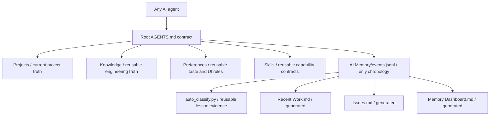

# qin-llm-wiki

An AI-first Obsidian memory architecture that keeps current knowledge readable and project history compact. It generates the same root-first structure while leaving every user's projects, events, preferences, and skills private and different.

## Why this exists

Most AI memory folders grow into duplicated daily logs, project logs, agent logs, and archive trees. This architecture uses:

- one current-truth layer for projects, knowledge, preferences, and skills;
- one append/update event store for project and module chronology;
- generated summaries instead of handwritten duplicate logs;
- stable issue IDs so repeated Bug attempts update one lifecycle row;
- cross-session project-result recall, with hashed session/task/group data retained only as provenance;
- placeholder and semantic-duplicate guards plus exact-ID invalid-record removal;
- bounded Ending candidates for durable personal preferences and technical working traits, with a strict no-op when no candidate exists;
- verified reusable-lesson classification and freshness-labeled external book-reference owners;
- a bounded AI query budget: one project, one module section, at most five events;
- strict UTF-8, wikilink/anchor, root-reachability, ghost-artifact, malformed-path, and event-integrity lint;
- a privacy gate before anything is published.

## Architecture



Generated vault root:

```text
AGENTS.md
CLAUDE.md
instruction.md
Start Here.md
Recent Work.md
Issues.md
Memory Dashboard.md
AI Memory/
Projects/
Knowledge/
Preferences/
Skills/
```

There is no Archive, Journal, History, Activity, raw, or hidden system content layer.

## Quick start

From the repository root:

macOS/Linux:

```text
python3 -B -m qin_llm_wiki init --vault "path/to/MyWiki" --name "My LLM Wiki"
python3 -B -m qin_llm_wiki verify --vault "path/to/MyWiki"
```

Windows PowerShell:

```text
py -3 -B -m qin_llm_wiki init --vault "path\to\MyWiki" --name "My LLM Wiki"
py -3 -B -m qin_llm_wiki verify --vault "path\to\MyWiki"
```

Open the generated folder as an Obsidian vault. Any AI should read its root `AGENTS.md` before accessing project memory.

## Record one outcome

macOS/Linux:

```text
python3 -B "path/to/MyWiki/AI Memory/ai_memory.py" record --project GameOne --module combat.damage --event-type bug-fix --summary "Fixed critical hit rounding" --reason "Damage was rounded before applying the multiplier" --result "Critical hit tests pass" --verification-status passed --issue-id combat-critical-001 --issue-status RESOLVED --bug-class logic --file "src/combat/damage.py" --verification "Focused combat tests passed" --risk none
```

Windows uses `py -3` and native backslash paths. Reuse the same `--issue-id` when the same Bug returns; the event row is updated and `attempt_count` increases instead of creating another log.

## Search without loading the vault

```text
python3 -B "path/to/MyWiki/AI Memory/ai_memory.py" search --project GameOne --module combat.damage --query "critical rounding" --limit 5 --compact
```

Compact mode returns only the fields needed for AI recall and avoids sending full evidence arrays into the model context. Matching project results remain visible across sessions; the compact row labels the session/task relation as provenance instead of filtering the result.

Ending-confirmed personal memory uses a separate bounded candidate payload. If the payload is empty, nothing is written:

```text
python3 -B "path/to/MyWiki/AI Memory/ai_memory.py" capture-memory --candidate-file "path/to/candidates.json"
```

The runtime validates the candidate, writes one `preference` event, and updates the stable Preferences owner page without storing raw prompts, results, paths, or secrets.

After a verified outcome, refresh the bounded reusable-lesson queue and current generated views:

```text
python3 -B "path/to/MyWiki/AI Memory/auto_classify.py" sync
python3 -B "path/to/MyWiki/AI Memory/ai_memory.py" render
python3 -B "path/to/MyWiki/AI Memory/memory_lint.py"
```

`remove-invalid` accepts only an exact placeholder event or a proven semantic duplicate identified with `--duplicate-of`. It rejects valid events and events referenced by a superseding result.

If a valid legacy event contains a personal home path, email, credential-like fragment, or other detected private value, sanitize only that event without echoing the removed text:

```text
python3 -B "path/to/MyWiki/AI Memory/ai_memory.py" redact-private --event-id "exact-event-id"
```

`redact-private` is guarded and idempotent. It preserves the event ID, replaces only detected private fragments, recomputes the semantic fingerprint, and refuses a rewrite that would create a semantic duplicate. It never rewrites `files`; repair an invalid legacy file list with the supported `amend --replace-file` flow.

Vaults created by an older release may still contain normalized task labels. After updating the managed runtime, migrate those labels once into hash-only provenance without changing event IDs or semantic fingerprints:

```text
python3 -B "path/to/MyWiki/AI Memory/ai_memory.py" migrate-provenance
```

The command is guarded and idempotent; a second run returns `no-op`.

## Update the architecture

Pull a newer version of this repository, then run:

```text
python3 -B -m qin_llm_wiki update --vault "path/to/MyWiki"
```

The updater never overwrites user content or `events.jsonl`. On an older vault it appends only missing canonical navigation and protocol fragments to the generic seed owners while preserving their existing bytes and all user additions; the migration is idempotent. Before its first write, it preflights every managed, seed, event-store, and generated-view path plus its vault-local ancestors; any symlink, wrong path type, or resolved path escape rejects the whole update. If an architecture-managed file was locally edited, it stops and reports current/template SHA-256 digests. Review the exact managed diff, then explicitly use `--force-managed` only when replacement is intentional. A private live vault is a downstream deployment, not a publishable mirror of this repository.

## Privacy

This repository contains no generated user vault and no personal memory. Before publishing a fork or template change, run:

```text
python3 -B -m qin_llm_wiki privacy-check --path .
```

See [Architecture](docs/ARCHITECTURE.md) and [Privacy](docs/PRIVACY.md) for the complete ownership and release contract.

## Tests

```text
python3 -B -m unittest discover -s tests -p "test_*.py" -v
```

The test suite generates an isolated vault under `Cache/tests/`, records and updates a repeated Bug, proves cross-session retrieval and guarded invalid-record removal, exercises auto-classification and strict lint failures, renders the generated views, checks architecture parity, verifies update preservation, and runs the privacy gate. `verify` also runs the generated runtime tests and a disposable record/search/render replay without touching the production event store.
