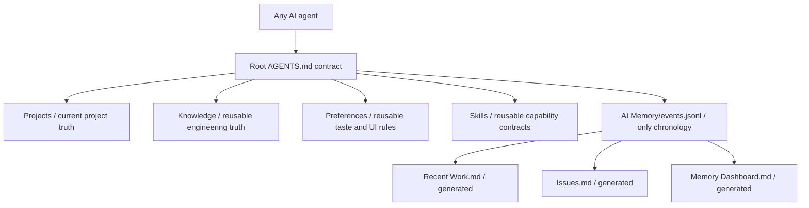

# qin-llm-wiki

An AI-first Obsidian memory architecture that keeps current knowledge readable and project history compact. It generates the same root-first structure while leaving every user's projects, events, preferences, and skills private and different.

## Why this exists

Most AI memory folders grow into duplicated daily logs, project logs, agent logs, and archive trees. This architecture uses:

- one current-truth layer for projects, knowledge, preferences, and skills;
- one append/update event store for project and module chronology;
- generated summaries instead of handwritten duplicate logs;
- stable issue IDs so repeated Bug attempts update one lifecycle row;
- a bounded AI query budget: one project, one module section, at most five events;
- a privacy gate before anything is published.

## Architecture



Generated vault root:

```text
AGENTS.md
CLAUDE.md
instruction.md
Start Here.md
Recent Work.md
Issues.md
Memory Dashboard.md
AI Memory/
Projects/
Knowledge/
Preferences/
Skills/
```

There is no Archive, Journal, History, Activity, raw, or hidden system content layer.

## Quick start

From the repository root:

macOS/Linux:

```text
python3 -m qin_llm_wiki init --vault "path/to/MyWiki" --name "My LLM Wiki"
python3 -m qin_llm_wiki verify --vault "path/to/MyWiki"
```

Windows PowerShell:

```text
py -3 -m qin_llm_wiki init --vault "path\to\MyWiki" --name "My LLM Wiki"
py -3 -m qin_llm_wiki verify --vault "path\to\MyWiki"
```

Open the generated folder as an Obsidian vault. Any AI should read its root `AGENTS.md` before accessing project memory.

## Record one outcome

macOS/Linux:

```text
python3 "path/to/MyWiki/AI Memory/ai_memory.py" record --project GameOne --module combat.damage --event-type bug-fix --summary "Fixed critical hit rounding" --reason "Damage was rounded before applying the multiplier" --result "Critical hit tests pass" --verification-status passed --issue-id combat-critical-001 --issue-status RESOLVED --bug-class logic --file "src/combat/damage.py" --verification "Focused combat tests passed" --risk none
```

Windows uses `py -3` and native backslash paths. Reuse the same `--issue-id` when the same Bug returns; the event row is updated and `attempt_count` increases instead of creating another log.

## Search without loading the vault

```text
python3 "path/to/MyWiki/AI Memory/ai_memory.py" search --project GameOne --module combat.damage --query "critical rounding" --limit 5 --compact
```

Compact mode returns only the fields needed for AI recall and avoids sending full evidence arrays into the model context.

## Update the architecture

Pull a newer version of this repository, then run:

```text
python3 -m qin_llm_wiki update --vault "path/to/MyWiki"
```

The updater never overwrites user content or `events.jsonl`. If an architecture-managed file was locally edited, it reports drift. Review it, then explicitly use `--force-managed` to accept the new managed contract/runtime.

## Privacy

This repository contains no generated user vault and no personal memory. Before publishing a fork or template change, run:

```text
python3 -m qin_llm_wiki privacy-check --path .
```

See [Architecture](docs/ARCHITECTURE.md) and [Privacy](docs/PRIVACY.md) for the complete ownership and release contract.

## Tests

```text
python3 -m unittest discover -s tests -v
```

The test suite generates an isolated vault, records and updates a repeated Bug, renders the generated views, checks architecture parity, verifies update preservation, and runs the privacy gate.
